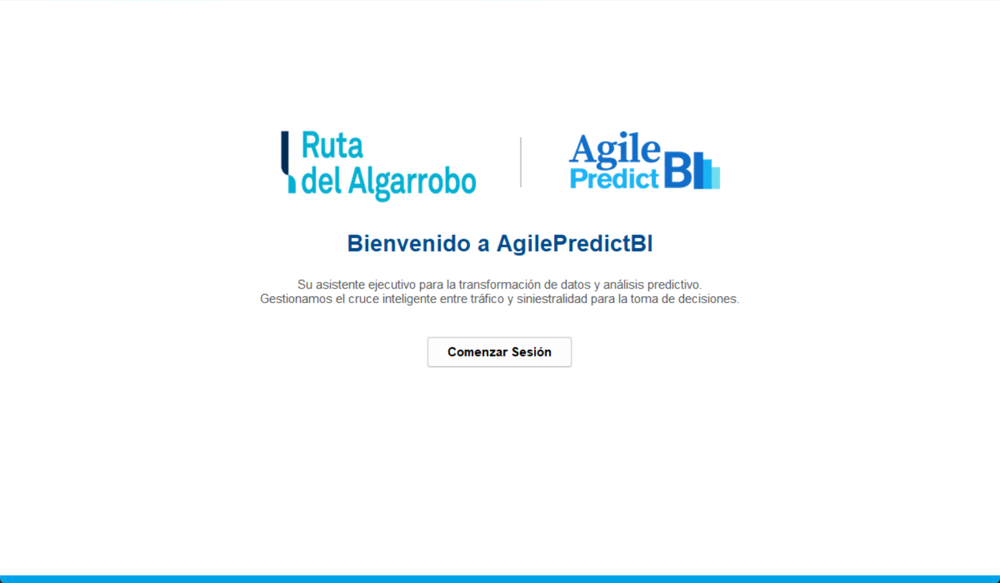
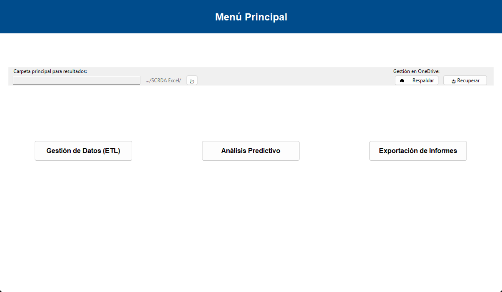
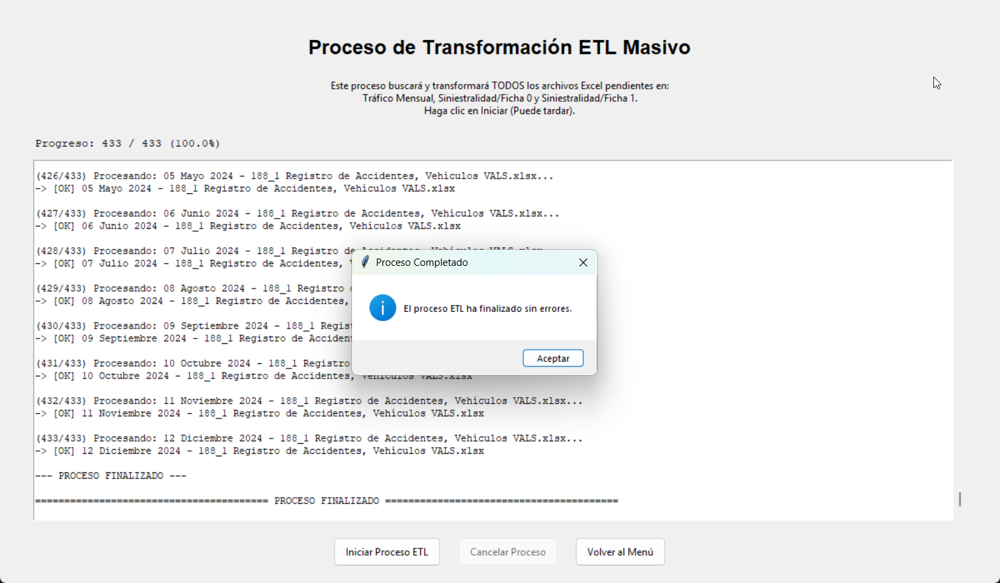
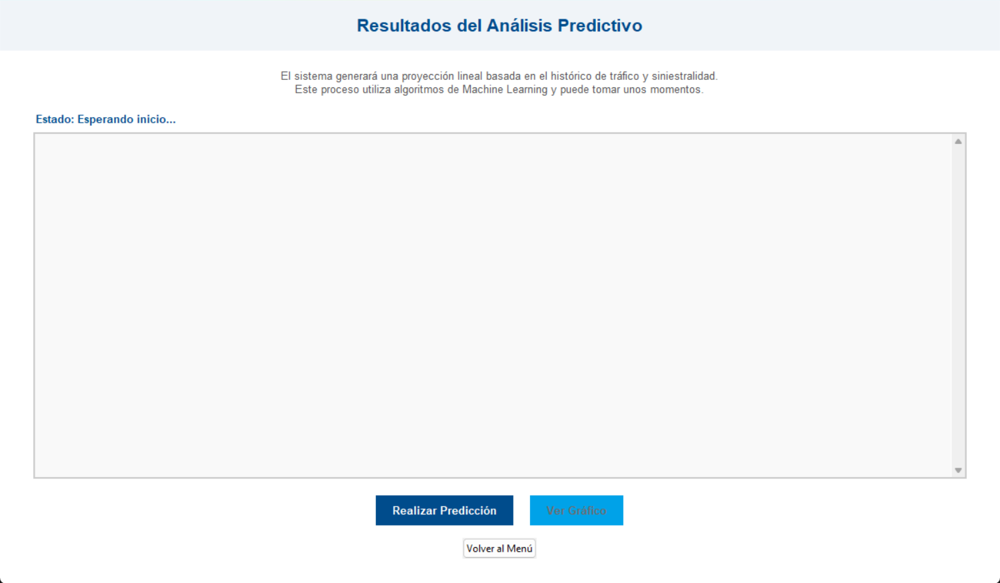
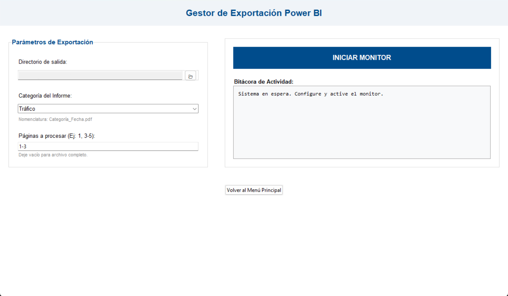

# AgilePredictBI-Project
AgilePredictBI es un sistema de Inteligencia de negocios, que permite visualizar, consultar y analizar datos históricos del peaje (tráfico y siniestralidad), a través de Dashboards interactivos utilizando Power BI.

En el sistema tiene cinco opciones:
- Definir carpeta principal de los resultados **(Importante)**
- Gestión de Datos (ETL)
- Análisis Predictivo
- Exportación de Informes
- Respaldar o Recuperar archivos en OneDrive.

Para poder 

## Gestión de Datos (ETL)
Tiene tres tipos de ETL:
- Siniestralidad
- Vehicular
- Tráfico Mensual

Las transformaciones se ejecutan en un mismo flujo, dejando en un formato consistente.

Al finalizar el proceso ETL, realiza otro proceso que es la creación de la base de datos, que se utilizará para la carga a Power BI

## Análisis Predictivo
Con los resultados del proceso anterior, el análisis predictivo usa la información de la base de datos y predice el flujo vehicular un mes después del último CSV limpio (mínimo 75% de precisión), mediante el algoritmo Regresión Lineal.

Al finalizar el proceso del análisis, se mostrarán dos gráficos:
- Primer gráfico: Datos históricos (Promedio Accidentes vs Volumen Tráfico)
- Segundo gráfico: Proyección del siguiente mes

También se guardará el gráfico y el CSV del resultado en la carpeta *Predicciones*

## Exportación de Informes
Al exportar un PDF en Power BI, guarda todos los Dashboards que existen, y queda guardado en una carpeta temporal.

Debido a esto, este proceso se encarga de mover el informe generado, pero con más opciones, donde puedes elegir:
- La ruta de origen para guardar el informe exportado.
- La categoría del informe (Tráfico, Siniestro, Predicción, Ejecutivo General).
- Rango de páginas (al dejarlo vacío, se exportará el informe tal como es originalmente)

Al configurar los parámetros de la exportación, puede iniciar el monitor, donde estará monitoreando en la carpeta temporal para detectar si existe algún informe de Power BI.
