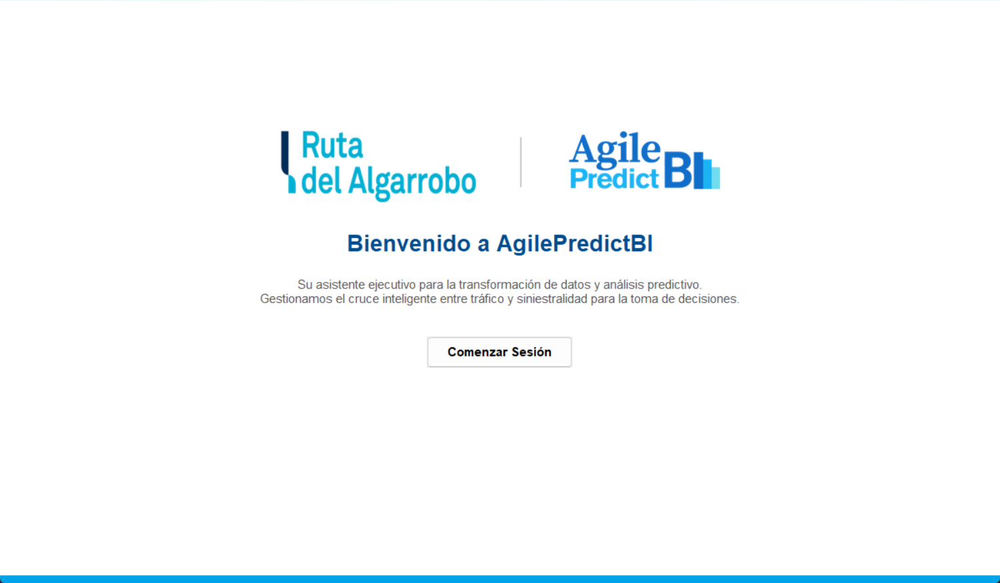
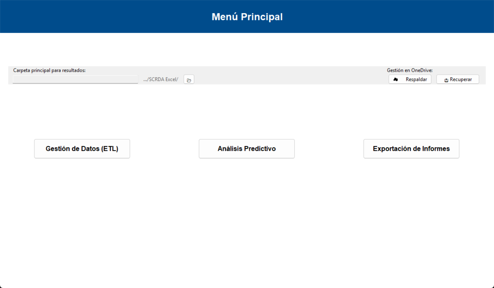
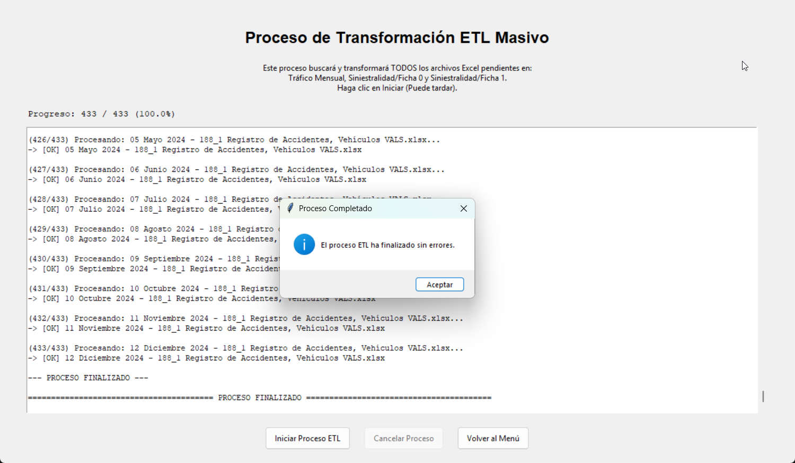
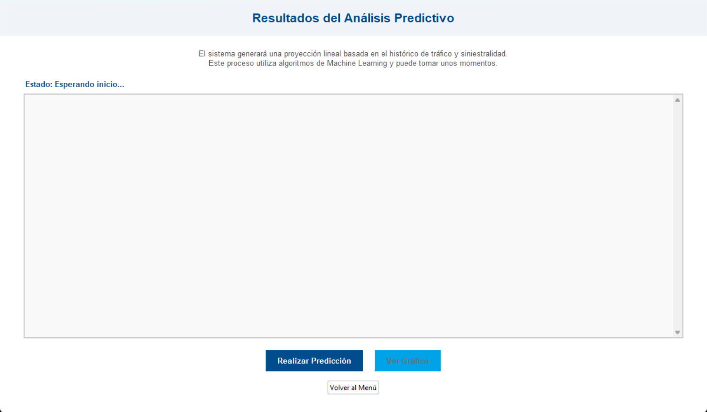
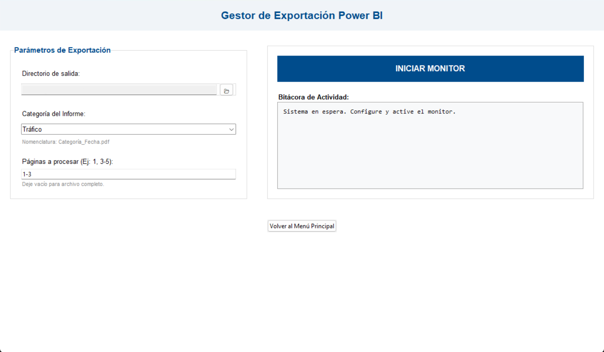

# AgilePredictBI-Project
AgilePredictBI es un sistema de Inteligencia de negocios, que permite visualizar, consultar y analizar datos históricos del peaje (tráfico y siniestralidad), a través de Dashboards interactivos utilizando Power BI.

En el sistema tiene cinco opciones:
- Definir carpeta principal de los resultados **(Importante)**
- Gestión de Datos (ETL)
- Análisis Predictivo
- Exportación de Informes
- Respaldar o Recuperar archivos en OneDrive.

## Gestión de Datos (ETL)
Tiene tres tipos de ETL:
- Siniestralidad
- Vehicular
- Tráfico Mensual

Las transformaciones se ejecutan en un mismo flujo, dejando en un formato consistente.

Al finalizar el proceso ETL, realiza otro proceso que es la creación de la base de datos, que se utilizará para la carga a Power BI

## Análisis Predictivo
Con los resultados del proceso anterior, el análisis predictivo usa la información de la base de datos y predice el flujo vehicular un mes después del último CSV limpio (mínimo 75% de precisión), mediante el algoritmo Regresión Lineal.

Al finalizar el proceso del análisis, se mostrarán dos gráficos:
- Primer gráfico: Datos históricos (Promedio Accidentes vs Volumen Tráfico)
- Segundo gráfico: Proyección del siguiente mes

También se guardará el gráfico y el CSV del resultado en la carpeta *Predicciones*

## Exportación de Informes
Al exportar un PDF en Power BI, guarda todos los Dashboards que existen, y queda guardado en una carpeta temporal.

Debido a esto, este proceso se encarga de mover el informe generado, pero con más opciones, donde puedes elegir:
- La ruta de origen para guardar el informe exportado.
- La categoría del informe (Tráfico, Siniestro, Predicción, Ejecutivo General).
- Rango de páginas (al dejarlo vacío, se exportará el informe tal como es originalmente)

Al configurar los parámetros de la exportación, puede iniciar el monitor, donde estará monitoreando en la carpeta temporal para detectar si existe algún informe de Power BI.

# Seguridad en AgilePredictBI

AgilePredictBI trabaja con datos sensibles de tráfico y siniestralidad.  
Para proteger esta información se definieron las siguientes normas básicas de seguridad:

## 1. Acceso al sistema

- El uso del sistema requiere **inicio de sesión** con usuario y contraseña.
- Cada persona debe usar **credenciales propias** (no compartir cuentas).
- Las contraseñas deben tener al menos **8 caracteres** y combinar letras y números.
- Si se sospecha de uso indebido, se debe **cambiar la contraseña** de inmediato.

## 2. Manejo de credenciales y tokens

- No se guardan usuarios ni contraseñas en el código fuente.
- Tokens o claves de acceso (GitHub, OneDrive, etc.) se configuran mediante
  **variables de entorno** o archivos excluidos del repositorio.
- El repositorio de AgilePredictBI en GitHub debe mantenerse **privado**.

## 3. Datos y respaldos

- La base de datos SQLite y los archivos CSV limpios se almacenan en carpetas
  con acceso restringido a usuarios autorizados.
- Se realizan **respaldos periódicos** de la base de datos y archivos clave,
  idealmente en OneDrive u otro almacenamiento corporativo.
- Los datos de prueba deben estar claramente diferenciados de los datos reales.

## 4. Uso responsable

- AgilePredictBI debe usarse solo para fines relacionados con la operación
  de la concesionaria y la generación de informes oficiales.
- Está prohibido modificar datos con el fin de alterar indicadores de manera intencional.
- Cualquier incidente de seguridad (pérdida de datos, acceso no autorizado, etc.)
  debe ser reportado al responsable técnico o a la Jefatura de Operaciones.

## 5. Clasificación de la Información

Para garantizar el cumplimiento normativo (ISO/IEC 27001), los datos gestionados por AgilePredictBI se clasifican de la siguiente manera:

| Activo de Información                | Clasificación    | Manejo Requerido |
| **Fichas de Siniestralidad (Excel)** | **CONFIDENCIAL** | Acceso restringido. Contiene PII (Patentes, Detalles de Accidentes). |
| **Base de Datos (SQLite)**           | **CONFIDENCIAL** | Almacenamiento en servidor seguro/local. Encriptación recomendada. |
| **Credenciales y Tokens**            | **CONFIDENCIAL** | No almacenar en texto plano. Uso de variables de entorno. |
| **Fichas de Tráfico (Excel)**        | **USO INTERNO**  | Uso exclusivo para operaciones de la concesionaria. |
| **Informes Exportados (PDF)**        | **USO INTERNO**  | Distribución controlada a gerencia y operaciones. |
| **Código Fuente y Manuales**         | **USO INTERNO**  | Repositorio privado. |

---

Para más detalles, revisar el documento de políticas de seguridad incluido en la documentación del proyecto.